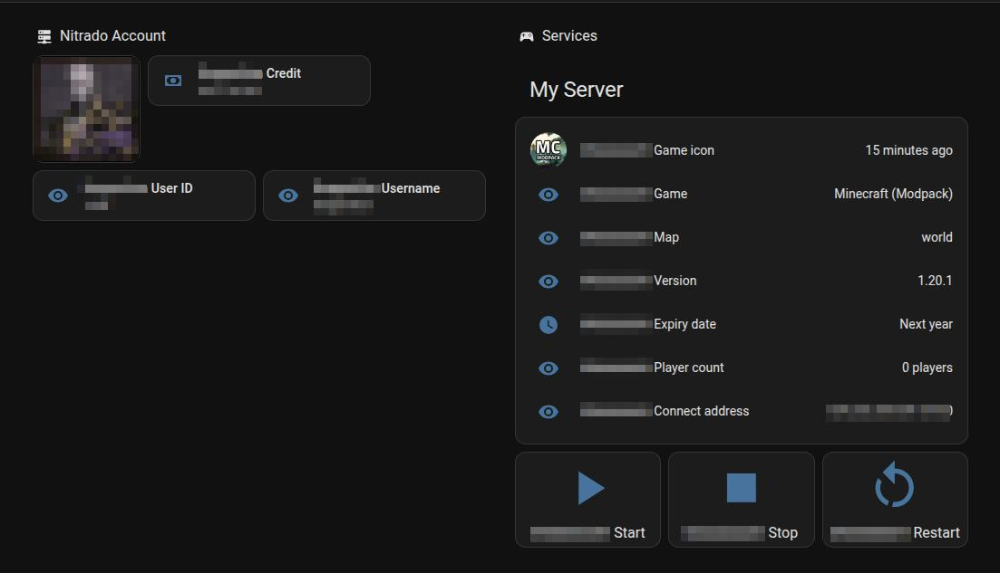
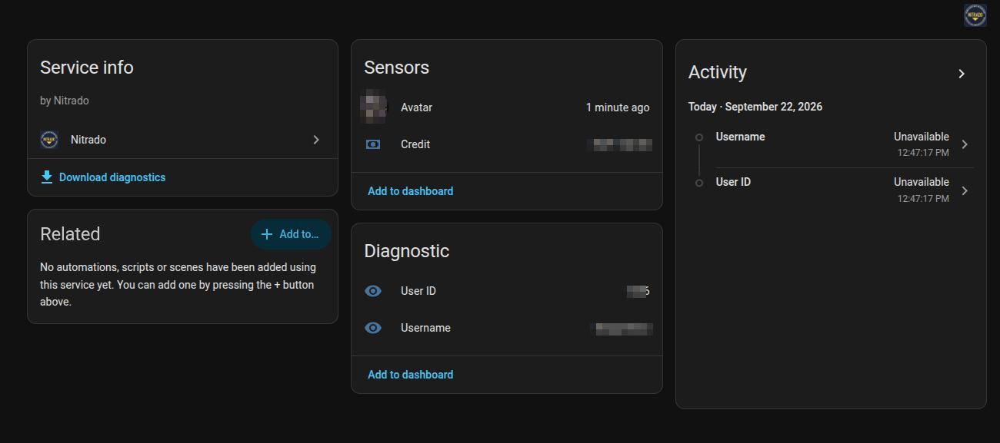
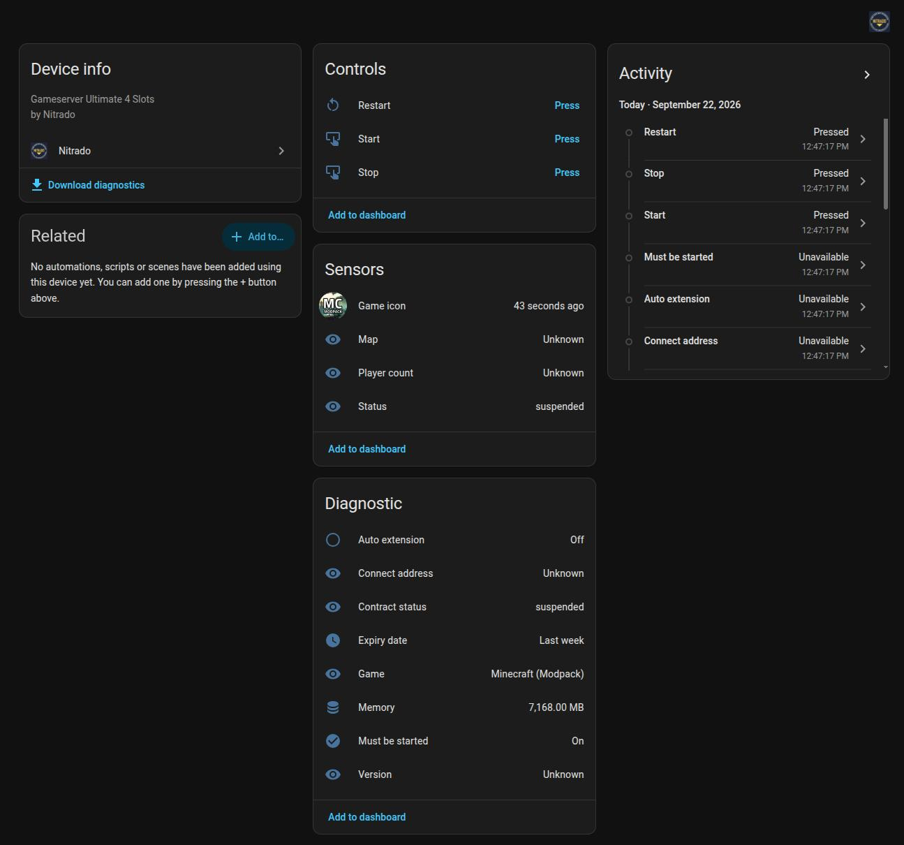

  

<h1 align="center">Nitrado – Home Assistant Integration</h1>

  
  
  
  

> **Unofficial, community-built integration.** Not affiliated with or
> supported by Nitrado.

Adds one **Nitrado Account** device plus one device per selected **game
server** to Home Assistant, set up entirely through the UI (config flow, no
YAML). Each device is polled by its own `DataUpdateCoordinator`, so entities
never poll individually.

## Screenshots

  

  
  

## Installation

### Via HACS (recommended)

1. HACS → three-dot menu → Custom repositories → paste
   `https://github.com/niKaphalor/ha-nitrado` → category "Integration" →
   Add.
2. Find "Nitrado" in the HACS integration list → Download.
3. Restart Home Assistant, then continue with [Setup](#setup) below.

### Manual

1. Copy the `custom_components/nitrado/` folder into your HA config
   directory, so it ends up at `<config>/custom_components/nitrado/`.
2. Restart Home Assistant.
3. Continue with [Setup](#setup) below.

### Setup

1. Settings → Devices & services → Add integration → "Nitrado".
2. Enter your API token (Nitrado account → Settings → API token).
3. Select the servers that should appear in HA.

Change the server selection later via the integration card → "Configure" –
this opens the options flow and reloads the entry automatically on save.

## Entities

### Nitrado Account

*One device per configured account.*

| Entity | Description |
| --- | --- |
| Credit | Account balance, converted from cents to the account currency (e.g. `19.55 EUR`) |
| User ID | Diagnostic sensor |
| Username | Diagnostic sensor |
| Avatar | Account profile picture |

Email address and postal address from the API are intentionally never
turned into entities.

### Per game server

*One device per selected service.*

| Entity | Description |
| --- | --- |
| Status | The game process itself (`started`/`stopped`/...) |
| Game | Which game is running (e.g. `Minecraft Vanilla`) |
| Game icon | The game's icon, resolved from Nitrado's game catalog |
| Must be started | Admin-configured target state — compare against Status to spot a server that should be running but isn't |
| Contract status | The subscription (`active`/`suspended`/...), distinct from the process status above |
| Expiry date | When the service will be suspended unless renewed |
| Auto extension | Whether the subscription renews itself |
| Player count | Current/max players, with a player name list attribute |
| Map, Version, Connect address | From the game's query response |
| Memory | Allocated RAM in MB — only added for Minecraft/Hytale, where that figure is meaningful |
| Start, Stop, Restart | Buttons to control the server |

A few notes on the details above:

- **Game** prefers the gameserver's `game_human`, falling back to the
  contract's `details.game`. It's distinct from the device model, which
  shows the Nitrado plan/tier (e.g. `Gameserver 16 Slots`), not the game.
- **Game icon** is matched via `folder_short` against
  `GET /gameserver/games`, picking the largest available size. That catalog
  is large and effectively static, so it's fetched once per setup/reload,
  not on every poll — the entity is only created when a matching icon is
  actually found.
- **Contract status** carries `slots`, `address`, `comment`, and
  `delete_date` as attributes.
- **Not every game answers the query protocol.** Player count, map,
  version, and connect address simply stay `unknown` for those instead of
  erroring.
- **Start**/**Restart** both call Nitrado's restart endpoint — there is no
  separate start endpoint, and restart also brings up a stopped server.
  Both require the API token to have server control permission; a press
  without it surfaces the resulting error in HA instead of failing
  silently.

### Never exposed

Some fields the API returns are deliberately never turned into entities or
diagnostics:

- Device credentials (FTP/MySQL passwords)
- Access tokens (`websocket_token`) — investigated as a possible
  live-update feed instead of polling; it appears scoped to a
  per-container console/log stream (gated by the game's
  `has_container_websocket` capability flag) rather than a general live
  status feed, and its connection protocol isn't publicly documented, so
  polling remains the integration's update mechanism
- Email address and postal address

The diagnostics download (Settings → Devices & services → Nitrado →
Download diagnostics) redacts all of the above.

## Architecture

For contributors — file layout

- `api.py` – thin async client, one method pair per endpoint
- `coordinator.py` – `NitradoCoordinator` (one per account, polls all
  selected services plus the bulk `/services` contract list in one update)
  and `NitradoAccountCoordinator` (account-level `/user` data)
- `config_flow.py` – two-step setup flow (token → server selection), plus
  an options flow for changing the selection later
- `entity.py` – shared `DeviceInfo` builders for the account and per-server
  devices, plus the game-icon catalog lookup
- `sensor.py` / `binary_sensor.py` / `image.py` / `button.py` – the
  entities described above
- `diagnostics.py` – config entry diagnostics dump, with the API token,
  `websocket_token`, FTP/MySQL credentials, email, and postal address all
  redacted
- `translations/en.json` / `translations/de.json` – entity names and
  config/options flow text; `strings.json` alone is not read for entity
  `translation_key` resolution at runtime, only as an English fallback
- `brand/` – local brand icon (HA 2026.3.0+ local-brands mechanism, no
  `home-assistant/brands` submission needed)

## License

[MIT](./LICENSE)
